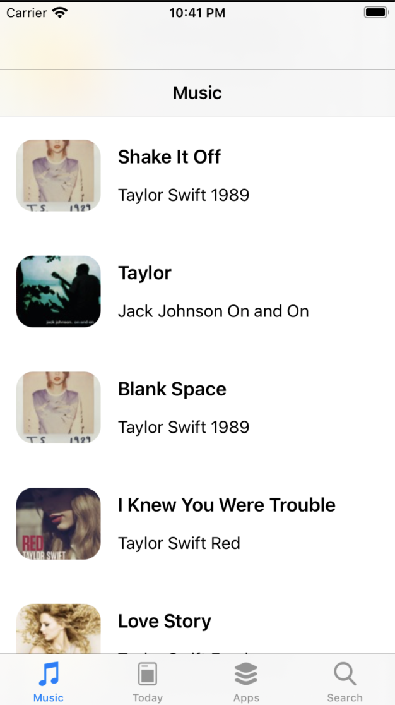
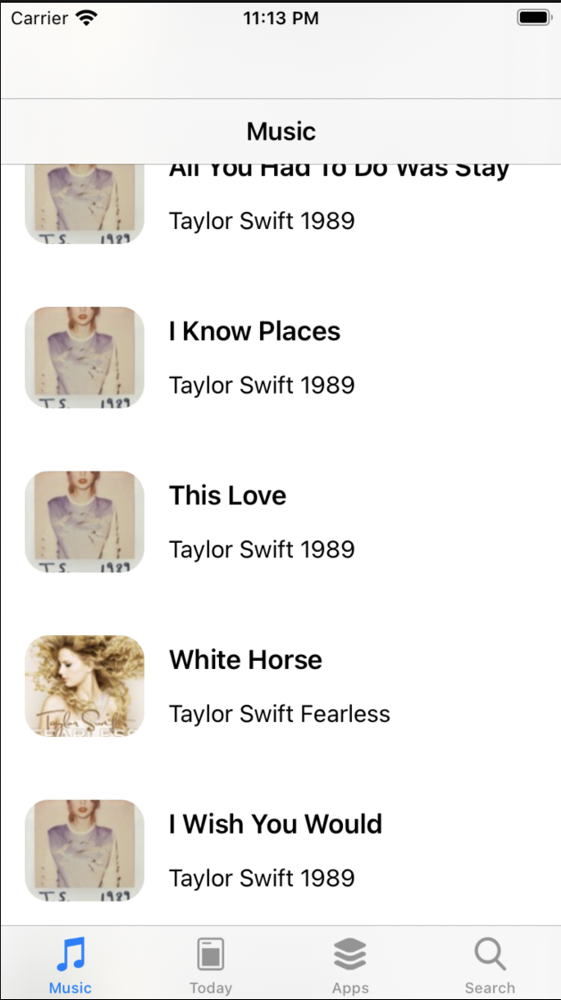
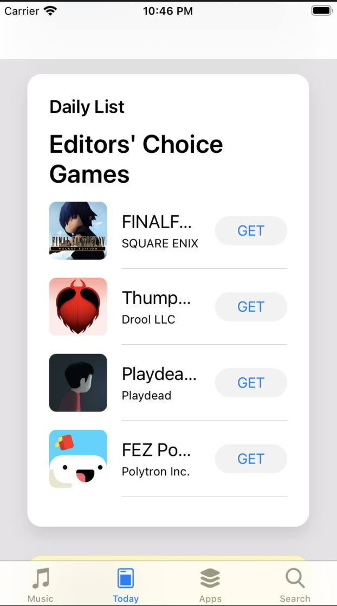
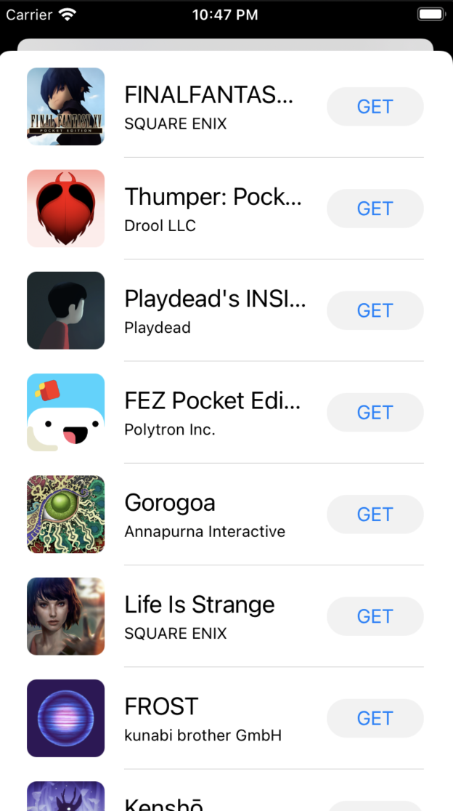
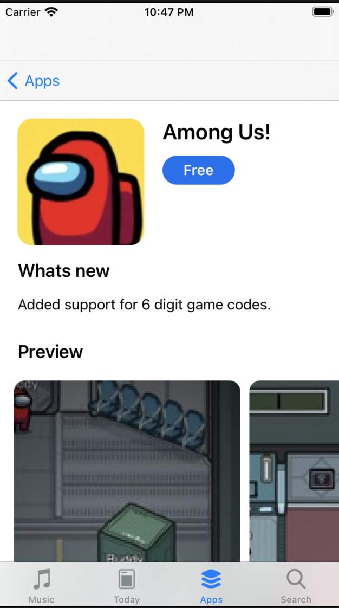
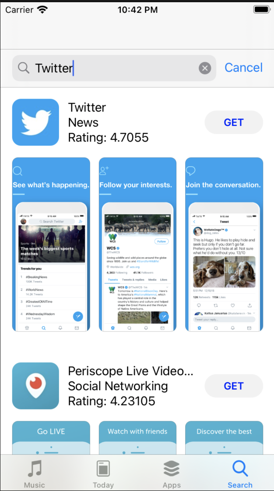
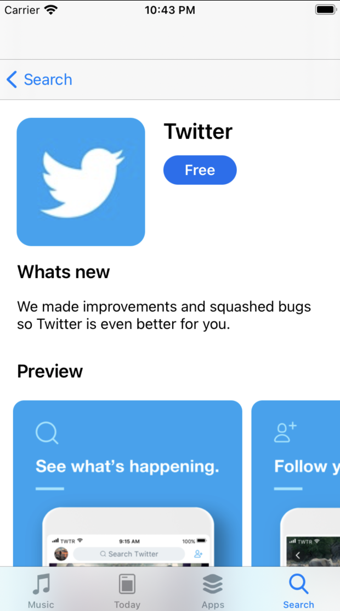

# The App Store Clone 

## About
A case study based on [Brian Voong's](https://www.youtube.com/channel/UCuP2vJ6kRutQBfRmdcI92mA) tutorials on iOS. The app attempts to mock Apple's App Store behavior. 
These behaviors consist of fetching iTunes data, displaying multiple tab controllers, displaying data in scroll view cells and animated feedback

The project follows the MVC architecture along with an API service class. 
The entire app contains four different tab controllers that demonstrate data representation in different ways

* **Music tab** Displays a list of Taylor Swift's songs

* **Today tab** Contains four main cells, two of them animate a zoom in transition, while the other two transition to a complete list of apps

* **Apps tab** Contains sections of *editor's choice*, *top free iphone apps* and *top grossing apps*. Each section has the ability to scroll and demonstate cells with the app's information and pop up interaction. 

* **Search tab** Allows the user to search any app by typing the name on the search bar. This will then display a list of apps matching the given name

Each tab has it's own Model, View and Controller. The view's were also manually coded in order to gain better controll of its size and display.

## Learning Objectives
* How to set up the user interface manually
* Setup navigation views and tab controllers
* Setup Decodable objects based on Itunes API
* Fetch Itunes data and convert JSON data into Swift decodable obejects
* Synchronize multiple fetches
* Snap collection view layouts when scrolling
* Handle user interaction with animated feedback

## Usage
You can run this project in Xcode and simulate the app on any desired Iphone simulator.

Welcome to the App store clone! This app contains many similar features you'd find in Apple's original app store. When you launch this app, you'll be
greeted with a tab bar that contains four different options.

| Music                                |  Today's highlight                           | Top of the list apps                 | Search the store                  |
:-------------------------------------:|:-------------------------------------------: |:------------------------------------:|:---------------------------------:|
| Check out Taylor's latest music feed |  See what's todays essential apps            |  look at today's top apps list      | Search an app you're interested in|
|    |   |   |  |

## Models 📬
All model objects are located in the [models](https://github.com/GeorgeSolorio/appStoreClone/tree/master/appStoreClone/Model) folder

| File                   | Description                                    | Obejcts                                  |
| -----------------------|:-----------------------------------------------|:-----------------------------------------|
| [AppGroup.swift](https://github.com/GeorgeSolorio/appStoreClone/blob/master/appStoreClone/Model/AppGroup.swift)         | The root of three major feed objects           | AppGroup, Feed, FeedResult               |
| [CustomerReviews.swift](https://github.com/GeorgeSolorio/appStoreClone/blob/master/appStoreClone/Model/CustomerReviews.swift)  | A set objects used for reviews                 | Reviews, ReviewFeed, Entry, Author, Label|
| [SearchResult.swift](https://github.com/GeorgeSolorio/appStoreClone/blob/master/appStoreClone/Model/SearchResult.swift)     | A set of search result keys                    | SearchResult, Result                     |
| [SocialApp.swift](https://github.com/GeorgeSolorio/appStoreClone/blob/master/appStoreClone/Model/SocialApp.swift)        | Holds keys for the app image information       | SocialApp                                |
| [todayItem.swift](https://github.com/GeorgeSolorio/appStoreClone/blob/master/appStoreClone/Model/TodayItem.swift)        | Holds information about the app's detailed data| TodayItem                                |

Each model is used for mapping JSON data into Swift decodable structs from the Itunes API

## Views 🖼
You can find the View folders in the [Views](https://github.com/GeorgeSolorio/appStoreClone/tree/master/appStoreClone/Views) folder

| Views                  | Description                                                                | Objects                               |
| -----------------------|:-----------------------------------------------------------------------------|:-----------------------------------------|
| [Apps](https://github.com/GeorgeSolorio/appStoreClone/tree/master/appStoreClone/Views/Apps)                   | This folder consits of files that help display details about the fetched app | AppRowCell, AppHeaderCell, AppDetailCell, PreviewCell,  ReviewInfoCell, ReviewRowCell |
| [Music](https://github.com/GeorgeSolorio/appStoreClone/tree/master/appStoreClone/Views/Music)                 | This folder helps display infomation about a given track                     | TrackCell, MusicLoadingFooter          |
| [Today](https://github.com/GeorgeSolorio/appStoreClone/tree/master/appStoreClone/Views/Today)                  | This folder consits of files that help display information on the Today Tab  | TodayAppFullScreenHeaderCell, BaseTodayCell, MultipleAppCell, TodayAppFullScreenDescriptionCell, TodayAppFullScreenHeaderCell, TodayCell, TodayMutipleAppsCell |
| [SearchResultCell.swift](https://github.com/GeorgeSolorio/appStoreClone/blob/master/appStoreClone/Views/SearchResultCell.swift) | The main cell view that display app information with an image, get button and description |

## Controller 🕹
You can find the controller classes in the [Controller](https://github.com/GeorgeSolorio/appStoreClone/tree/master/appStoreClone/Controller) folder
| Controllers              | Description                                    |
| -------------------------|:-----------------------------------------------|
| [App](https://github.com/GeorgeSolorio/appStoreClone/tree/master/appStoreClone/Controller/Apps)                      | This folder helps initialize and display the app's tab view. It uses SwiftUI for its collection view and displays the sections with a collection of apps that scrolled trough and selected |
| [Today](https://github.com/GeorgeSolorio/appStoreClone/tree/master/appStoreClone/Controller/Today)                    | This folder consits of code that helps display four main cells. Each cell displays information, provides user interaction and creates feedback by zooming in and out of a cell in an animated way |
| [Base](https://github.com/GeorgeSolorio/appStoreClone/tree/master/appStoreClone/Controller)                   | A set of base controllers consisting of common behaviours found in many of our views. These objects allow us to speed up the process initializing controllers such as the TabBarController, BaseListController and HorizontalSnappingController |
| [Search](https://github.com/GeorgeSolorio/appStoreClone/tree/master/appStoreClone/Controller/Search)  | This folder consists of a single file that makes use of Apple's UISearchController, allowing us to fetch user input |

## Service 📥
You can find the Service class in the [Service](https://github.com/GeorgeSolorio/appStoreClone/tree/master/appStoreClone/Service) folder

## Third party services: SDWebImage 
We used [SDWebImage](https://github.com/SDWebImage/SDWebImage) to help us display fetched images in a simpler and intuitive way 

